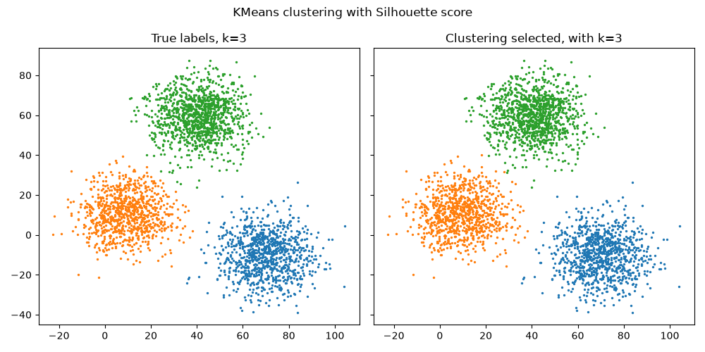

CVI - Basic usage
------------------

In this example, we integrate PyCVI into the usual clustering pipeline in order to select the best clustering.

.. include:: /examples/examples_reminders.rst

.. literalinclude:: ../../examples/basic_usage/basic_usage.py
   :linenos:
   :start-after: sys.stdout = fout
   :end-before: fout.close()

.. literalinclude:: ../../examples/basic_usage/output-basic_usage_KMeans_Silhouette.txt
   :language: text