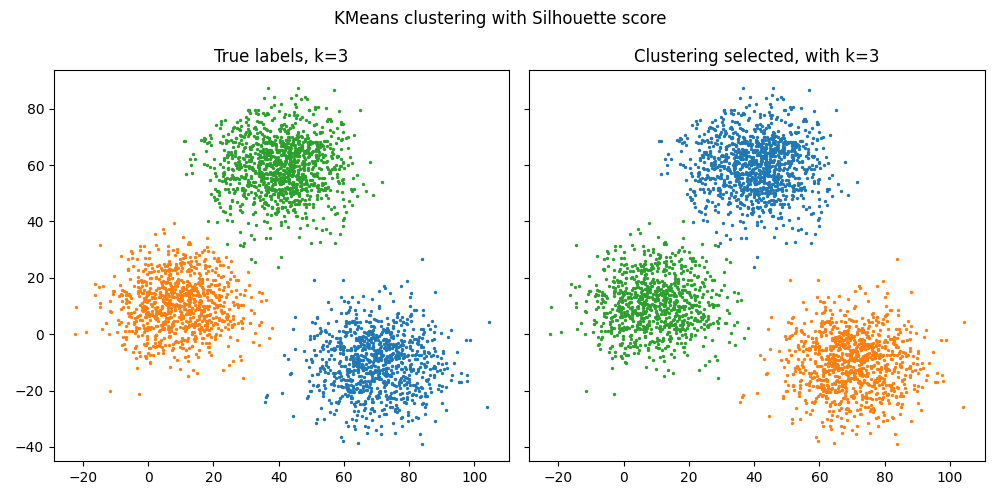

Basic Usage
-------------

In this example, we integrate PyCVI into the usual clustering pipeline in order to select the best clustering.

.. literalinclude:: ../../../examples/basic_usage/basic_usage.py
   :lines: 7-61

.. literalinclude:: ../../../examples/basic_usage/output-basic_usage_KMeans_Silhouette.txt
   :language: text