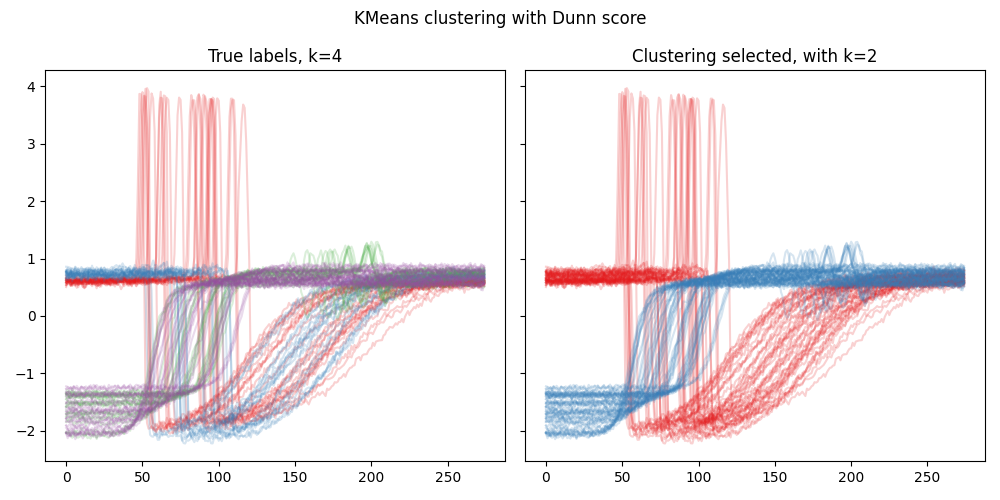

CVI - Basic usage with time-series
----------------------------------

In this example, we integrate PyCVI into the usual clustering pipeline with time series data in order to select the best clustering while using DTW as the distance measure and DBA as the cluster center.

.. literalinclude:: ../../examples/basic_usage_time_series/basic_usage_time_series.py
   :lines: 7-63

.. literalinclude:: ../../examples/basic_usage_time_series/output-basic_usage_TS_KMeans_Dunn.txt
   :language: text