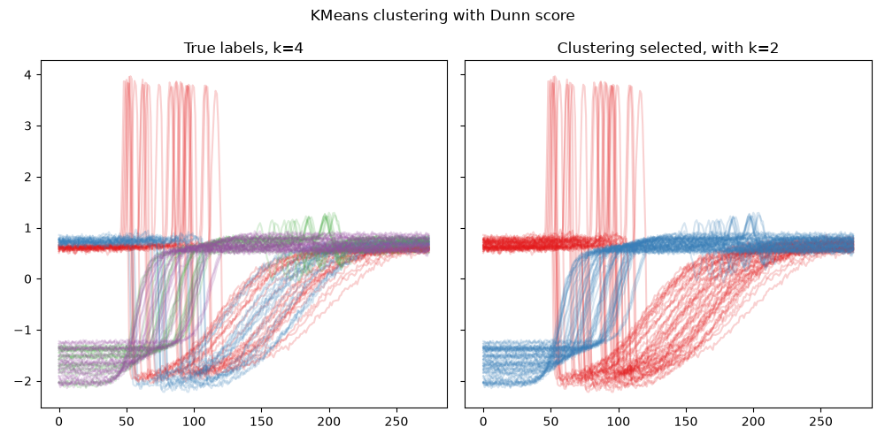

CVI - Basic usage with time-series
----------------------------------

In this example, we integrate PyCVI into the usual clustering pipeline with time series data in order to select the best clustering while using MSM as the distance measure and MBA as the cluster center, specially designed to handle time-series data.

.. include:: /examples/examples_reminders.rst

.. literalinclude:: ../../examples/basic_usage_time_series/basic_usage_time_series.py
   :linenos:
   :start-after: sys.stdout = fout
   :end-before: fout.close()

.. literalinclude:: ../../examples/basic_usage_time_series/output-basic_usage_TS_KMeans_Dunn.txt
   :language: text