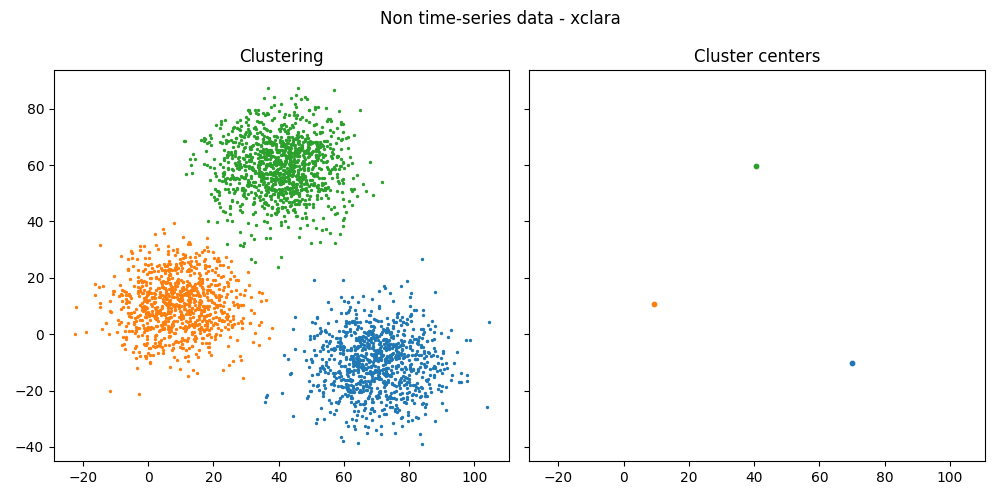
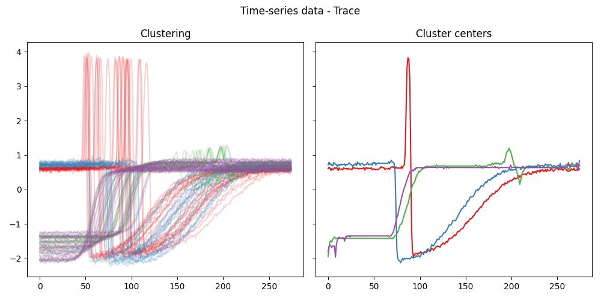
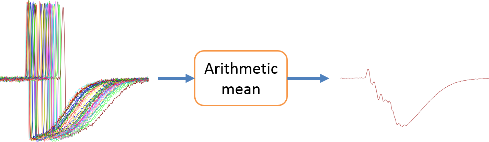
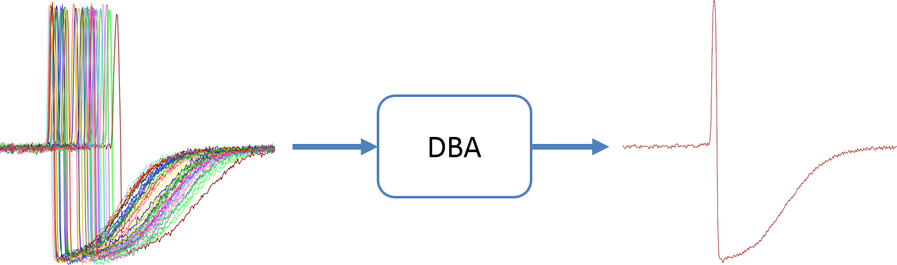

Computing cluster centers
----------------------------------

In this example, we compute the cluster centers for time series data and non time-series data and we show that from the user point of view, the approach is the same, even though PyCVI has to compute the DBA of the cluster in the time-series case.

.. include:: /examples/examples_reminders.rst

.. literalinclude:: ../../examples/cluster_center/cluster_center.py
   :lines: 4-43

For an example showing the importance of using DBA instead of the arithmetic mean see Petitjean et al [DBA]_. Below is an example from their `GitHub repository <https://github.com/fpetitjean/DBA>`_:

.. [DBA] F. Petitjean, A. Ketterlin, and P. Gan carski, “A global
   averaging method for dynamic time warping, with applications to
   clustering,” *Pattern Recognition*, vol. 44, pp. 678–693, Mar.
   2011.