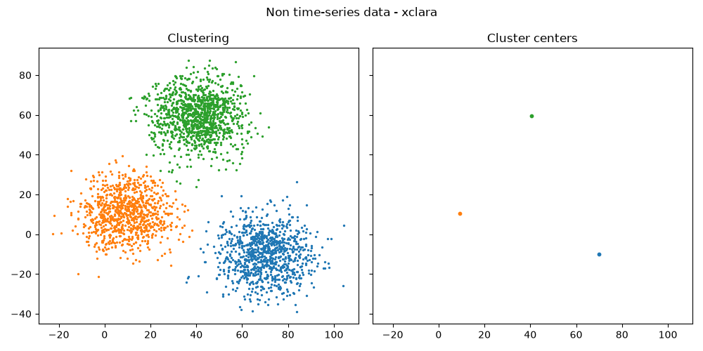
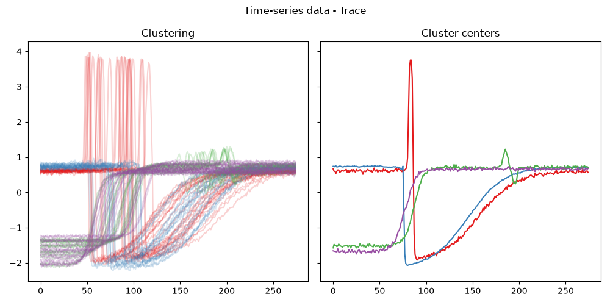
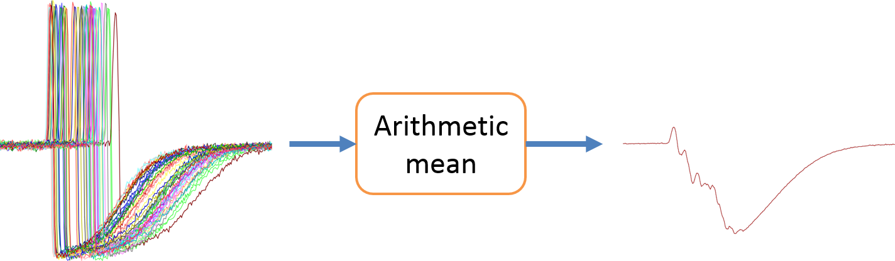
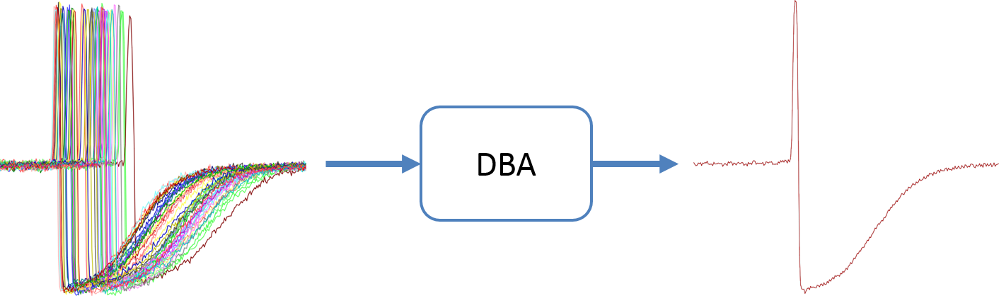
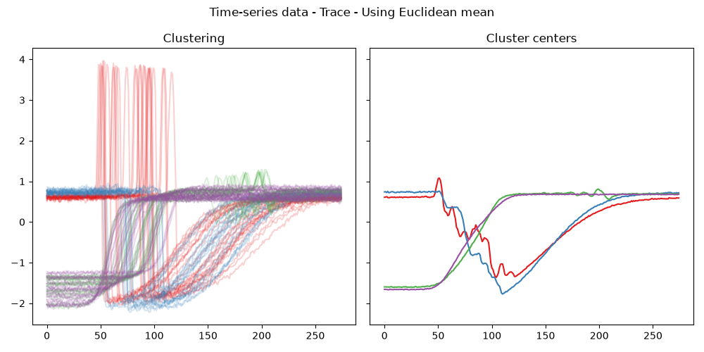

Computing cluster centers
----------------------------------

In this example, we compute cluster centers for time-series and
non-time-series data. The user interface is the same in both cases,
even though PyCVI computes a DBA for each cluster in the time-series case.

.. include:: /examples/examples_reminders.rst

.. literalinclude:: ../../examples/cluster_center/cluster_center.py
   :linenos:
   :start-after: sys.path.append('./examples')
   :emphasize-lines: 16, 31

For an example showing the importance of using DBA (or MBA [MBA]_) instead of the arithmetic
mean, see Petitjean et al. [DBA]_. Below is an example from their
`GitHub repository <https://github.com/fpetitjean/DBA>`_:

Following our example above, here are the cluster centers if we had used the
arithmetic mean instead of DBA (or MBA [MBA]_):

.. [DBA] F. Petitjean, A. Ketterlin, and P. Gan carski, “A global
   averaging method for dynamic time warping, with applications to
   clustering,” *Pattern Recognition*, vol. 44, pp. 678–693, Mar.
   2011.
.. [MBA] Christopher Holder, David Guijo-Rubio, and Anthony Bagnall.
   Barycentre averaging for the move-split-merge time series
   distance measure. 15th International Joint Conference on
   Knowledge Discovery, Knowledge Engineering and Knowledge
   Management (2023)