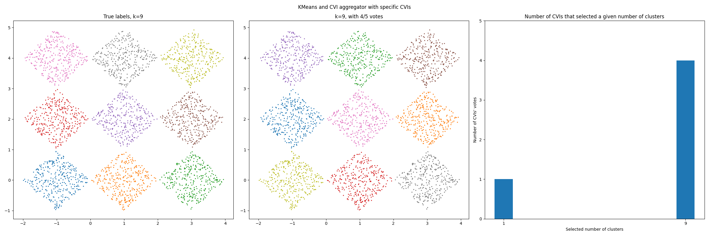

CVIAggregator: Combining CVIs
-------------------------------------------

Here is an example using exclusively PyCVI's :class:`pycvi.cvi.CVIAggregator` in order to guess the number of clusters in a dataset. The preprocessing steps and the clustering steps can be integrated into the PyCVI pipeline by providing sklearn-like classes of clustering models (e.g. `KMeans <https://scikit-learn.org/stable/modules/generated/sklearn.cluster.KMeans.html>`_) and data preprocessor (e.g. `StandardScaler <https://scikit-learn.org/stable/modules/generated/sklearn.preprocessing.StandardScaler.html>`_).

In this example, we use non-time-series data, but the syntax would be the same for time-series data.

Here we assume that we are in real conditions, which means that we don't have access to the true labels (except that we plot the true data for illustrating purpose). We then don't use the features included in the :mod:`pycvi.vi` module.

This example showcases 2 successful clusterings and clustering selections.

.. include:: /examples/examples_reminders.rst

.. literalinclude:: ../../examples/cvi_aggregator/cvi_aggregator.py
   :lines: 7-152

.. image:: ../../examples/cvi_aggregator/Barton_data_AgglomerativeClustering_Single-all_cvis.png.png

.. literalinclude:: ../../examples/cvi_aggregator/output-cvi_aggregator.txt
   :language: text