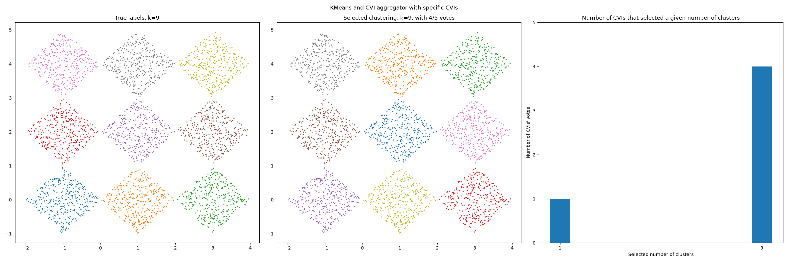
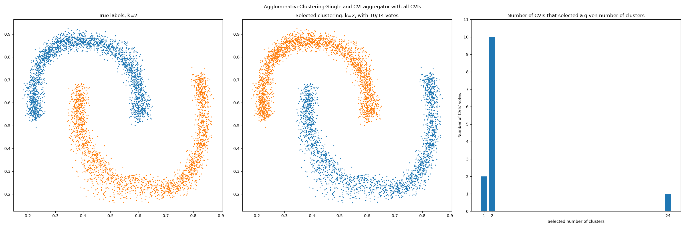

CVIAggregator: Combining CVIs
-------------------------------------------

Here is an example using PyCVI's :class:`pycvi.cvi.CVIAggregator` to select
the best number of clusters, :math:`k`, from several candidate values. The
example uses ``generate_all_clusterings`` with ``KMeans`` and
``AgglomerativeClustering``; for both methods, :math:`k` is the main
clustering parameter and is passed as ``n_clusters=k``. The preprocessing and
clustering steps can be integrated into the PyCVI pipeline by providing
scikit-learn-like model classes (e.g. `KMeans <https://scikit-learn.org/stable/modules/generated/sklearn.cluster.KMeans.html>`_) and data preprocessors (e.g. `StandardScaler <https://scikit-learn.org/stable/modules/generated/sklearn.preprocessing.StandardScaler.html>`_).

This example uses non-time-series data, but the syntax is the same for
time-series data.

Here we assume that we are in real conditions, which means that we don't have access to the true labels (except that we plot the true data for illustrative purposes). We then don't use the features included in the :mod:`pycvi.vi` module.

This example showcases 2 successful clustering and selection workflows.

.. include:: /examples/examples_reminders.rst

.. literalinclude:: ../../examples/cvi_aggregator/cvi_aggregator.py
   :linenos:
   :start-after: sys.stdout = fout
   :end-before: fout.close()
   :emphasize-lines: 64-71, 83-90, 98, 116, 126-127, 133, 138-139, 146

.. literalinclude:: ../../examples/cvi_aggregator/output-cvi_aggregator.txt
   :language: text