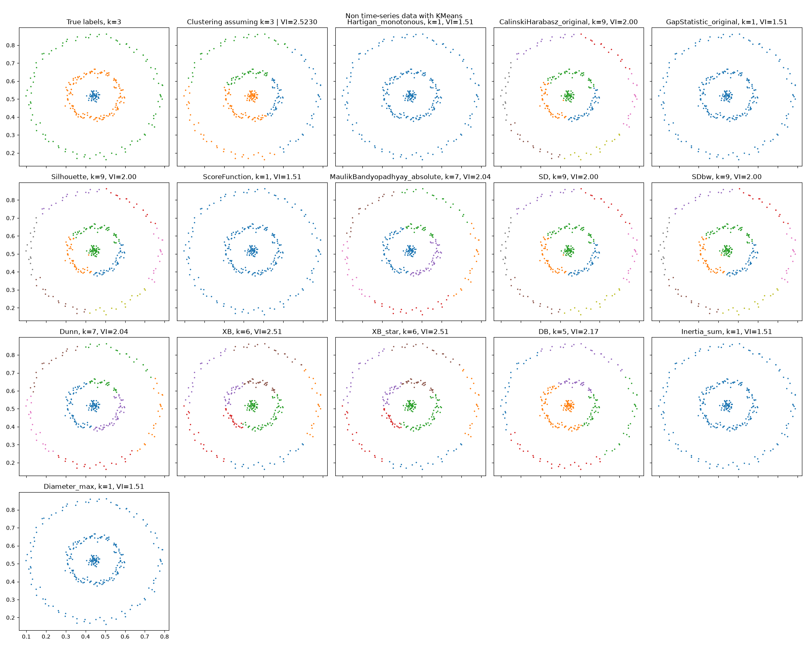
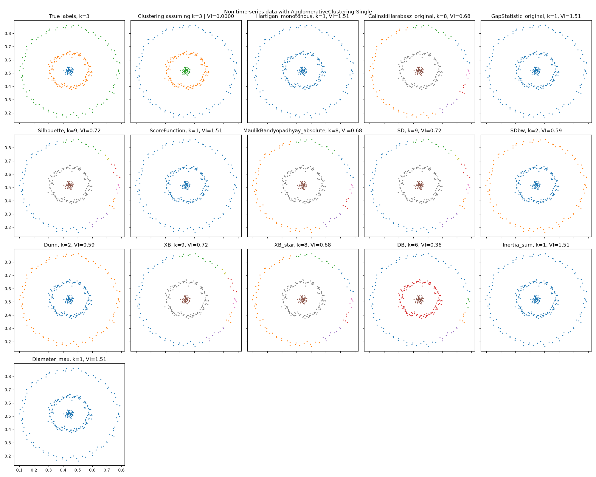
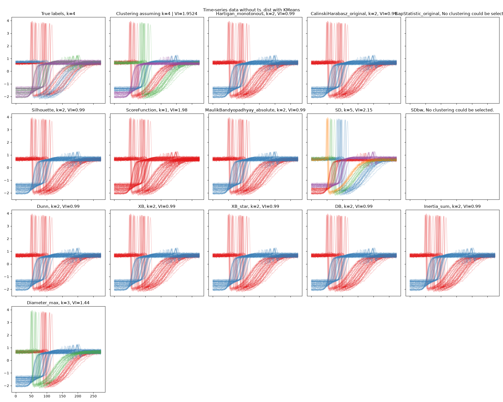
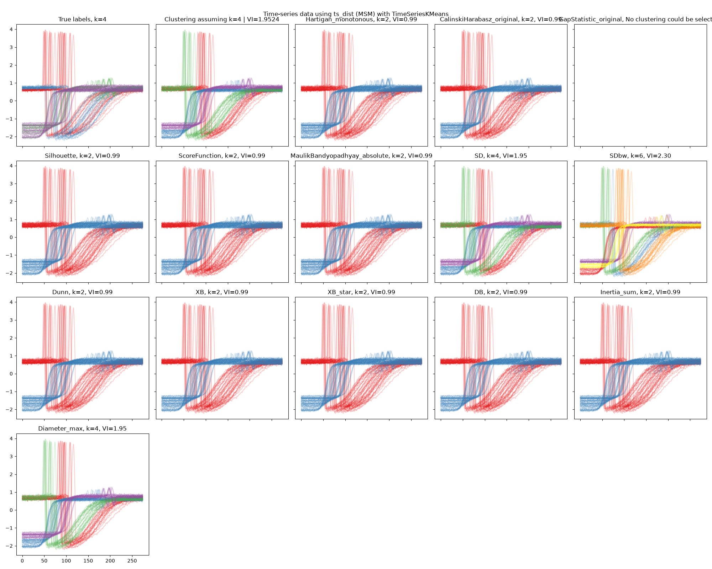

Full PyCVI pipeline
----------------------

Here is an example using exclusively PyCVI for the entire clustering pipeline. The
preprocessing and clustering steps can be integrated into the PyCVI pipeline
by providing scikit-learn-like model classes (e.g. `KMeans <https://scikit-learn.org/stable/modules/generated/sklearn.cluster.KMeans.html>`_) and data preprocessors (e.g. `StandardScaler <https://scikit-learn.org/stable/modules/generated/sklearn.preprocessing.StandardScaler.html>`_).

This example uses both time-series and non-time-series data. It tries several
values of :math:`k`, the number of clusters, with methods where :math:`k` is
the main clustering parameter. It also illustrates
compatibility with `scikit-learn <https://scikit-learn.org/stable/index.html>`_, `scikit-learn extra <https://scikit-learn-extra.readthedocs.io/en/stable/>`_ and `aeon <https://www.aeon-toolkit.org/en/latest/index.html>`_.

.. include:: /examples/examples_reminders.rst

.. literalinclude:: ../../examples/full_example/full_example.py
   :linenos:
   :start-after: sys.stdout = fout
   :end-before: fout.close()
   :emphasize-lines: 64-71, 82-83, 91-94, 105, 109-116, 128, 165, 181, 208, 223

.. literalinclude:: ../../examples/full_example/output-full_example.txt
   :language: text