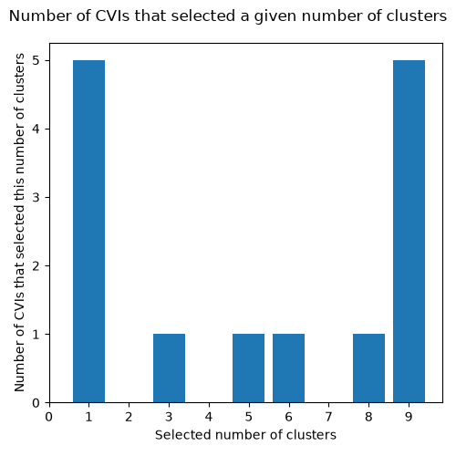
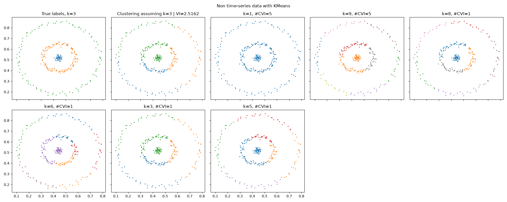
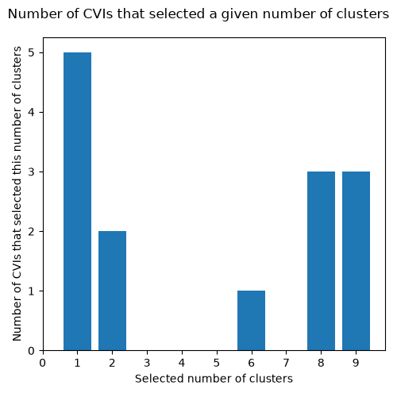
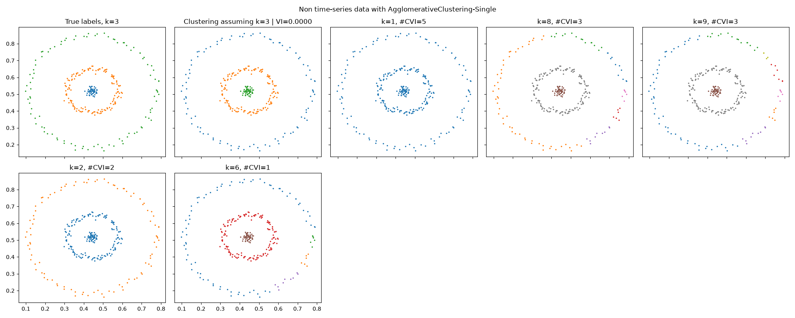
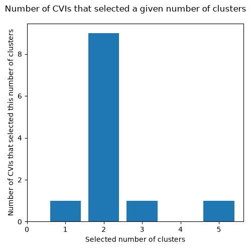
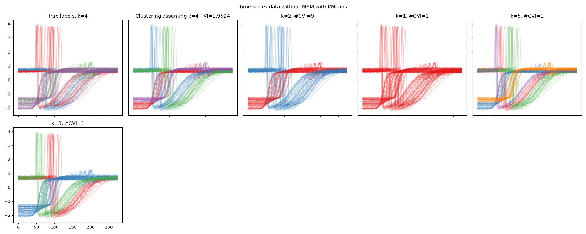
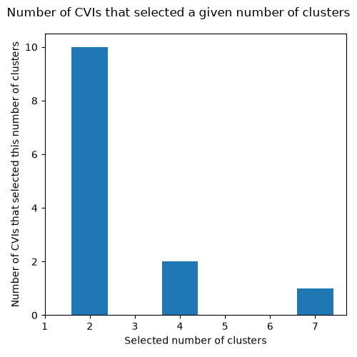
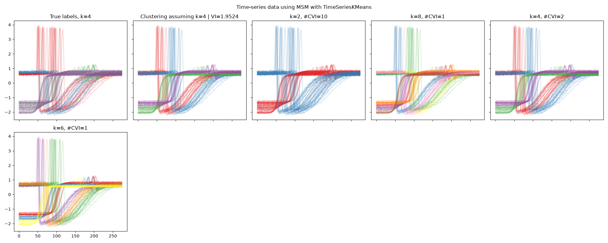

Selecting the number of clusters k
---------------------------------------

Here is an example using PyCVI to select the best number of clusters,
:math:`k`, from several candidate values. The preprocessing and clustering
steps can be integrated into the PyCVI pipeline by providing scikit-learn-like
model classes (e.g. `KMeans <https://scikit-learn.org/stable/modules/generated/sklearn.cluster.KMeans.html>`_) and data preprocessors (e.g. `StandardScaler <https://scikit-learn.org/stable/modules/generated/sklearn.preprocessing.StandardScaler.html>`_). In the methods shown here, :math:`k` is
the main clustering parameter and is passed as ``n_clusters=k``.

This example uses both time-series and non-time-series data. It also uses
`scikit-learn <https://scikit-learn.org/stable/index.html>`_, `scikit-learn extra <https://scikit-learn-extra.readthedocs.io/en/stable/>`_ and `aeon <https://www.aeon-toolkit.org/en/latest/index.html>`_ classes to illustrate PyCVI's
compatibility with scikit-learn-like libraries.

Here we assume that we are in real conditions, which means that we don't have access to the true labels (except that we plot the true data for illustrative purposes). We then don't use the features included in the :mod:`pycvi.vi` module.

.. include:: /examples/examples_reminders.rst

.. literalinclude:: ../../examples/select_k/select_k.py
   :linenos:
   :start-after: sys.stdout = fout
   :end-before: fout.close()
   :emphasize-lines: 65-72, 87, 91-98, 110, 164, 180, 206, 220

.. literalinclude:: ../../examples/select_k/output-select_k.txt
   :language: text