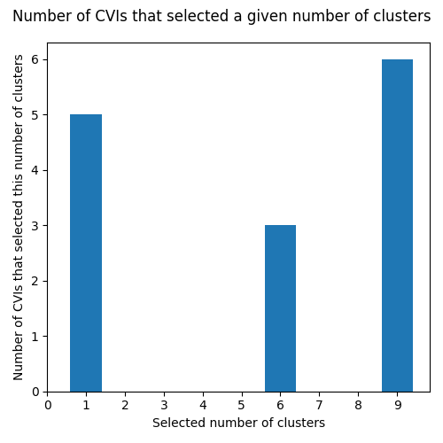
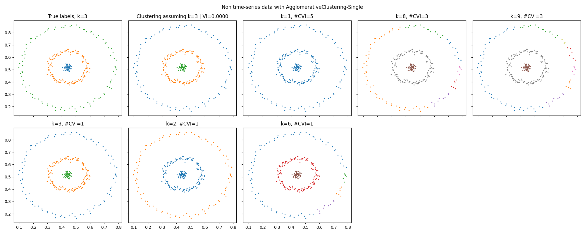
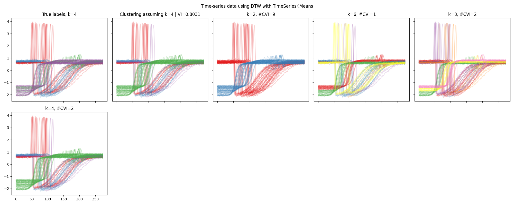

Select the number of clusters k
---------------------------------------

Here is an example using exclusively PyCVI in order to guess the number of clusters in a dataset. The preprocessing steps and the clustering steps can be integrated into the PyCVI pipeline by providing sklearn-like classes of clustering models (e.g. `KMeans <https://scikit-learn.org/stable/modules/generated/sklearn.cluster.KMeans.html>`_) and data preprocessor (e.g. `StandardScaler <https://scikit-learn.org/stable/modules/generated/sklearn.preprocessing.StandardScaler.html>`_).

In this example, we use time-series data and non-time-series data. In addition we use classes from `scikit-learn <https://scikit-learn.org/stable/index.html>`_, `scikit-learn extra <https://scikit-learn-extra.readthedocs.io/en/stable/>`_ and `aeon <https://www.aeon-toolkit.org/en/latest/index.html>`_ in order to illustrate the compatibility of PyCVI with sklearn-like libraries.

Here we assume that we are in real conditions, which means that we don't have access to the true labels (except that we plot the true data for illustrating purpose). We then don't use the features included in the :mod:`pycvi.vi` module.

.. include:: /examples/examples_reminders.rst

.. literalinclude:: ../../examples/select_k/select_k.py
   :lines: 7-220

.. image:: ../../examples/select_k/UCR_data_no_DTW_KMedoids-histogram.png

.. image:: ../../examples/select_k/UCR_data_no_DTW_KMedoids.png

.. literalinclude:: ../../examples/select_k/output-select_k.txt
   :language: text