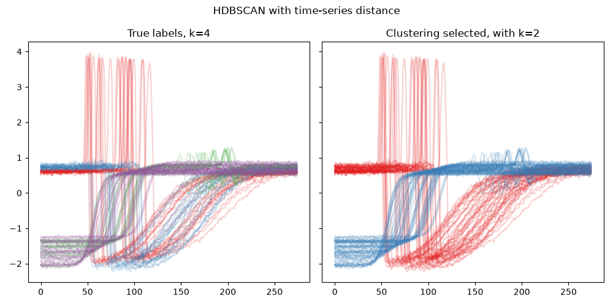

Time-series metric with scikit-learn
--------------------------------------

In this example, we integrate a time-series metric with scikit-learn
clustering methods, namely `AgglomerativeClustering <https://scikit-learn.org/stable/modules/generated/sklearn.cluster.AgglomerativeClustering.html>`_ and `HDBSCAN <https://scikit-learn.org/stable/modules/generated/sklearn.cluster.HDBSCAN.html>`_. This is possible with clustering methods that accept a custom metric, using PyCVI's :func:`pycvi.dist.time_series_metric_with_sklearn` function. Not all scikit-learn clustering methods support custom metrics; for example, `KMeans <https://scikit-learn.org/stable/modules/generated/sklearn.cluster.KMeans.html>`_ does not.

Combining a time-series metric with a scikit-learn-like model is not
straightforward without PyCVI because time-series libraries and scikit-learn use different
input shapes. Time-series libraries typically require ``(N, T, d)``, whereas
scikit-learn-like models require ``(N, d)``. PyCVI solves this issue by
reshaping the data on the fly inside the clustering model.

The example contains two cases. AgglomerativeClustering receives an explicit
``n_clusters=k``, so :math:`k` is the main clustering parameter. HDBSCAN does
not use :math:`k` as its main parameter; it determines the clustering from
other parameters, so its resulting number of clusters is not selected by
varying :math:`k`.

.. include:: /examples/examples_reminders.rst

.. literalinclude:: ../../examples/ts_metric_with_sklearn/ts_metric_with_sklearn.py
   :linenos:
   :emphasize-lines: 29-33, 54-58

.. image:: ../../examples/ts_metric_with_sklearn/ts_metric_with_sklearn_Agglo.png

