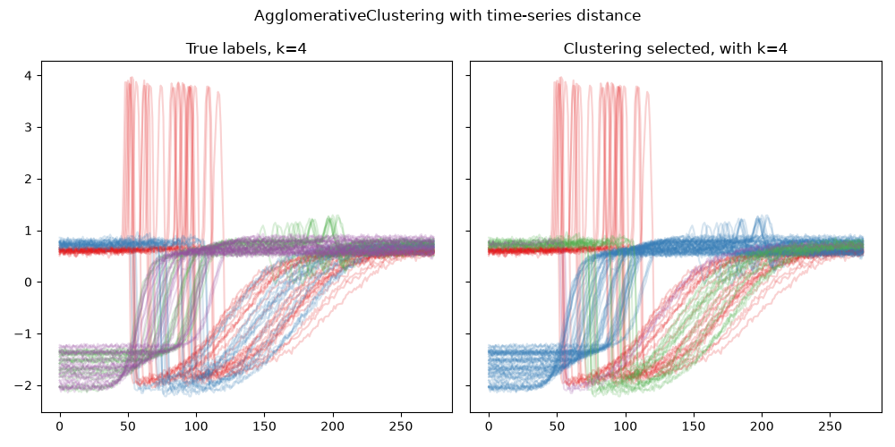

Time-Series metric with Sklearn
---------------------------------

In this example, we integrate the use of a time-series metric with a scikit-learn clustering method, namely `AgglomerativeClustering <https://scikit-learn.org/stable/modules/generated/sklearn.cluster.AgglomerativeClustering.html>`_. This is possible thanks to PyCVI's :func:`pycvi.dist.time_series_metric_with_sklearn` function and whenever a clustering method allows the use of a custom metric. Note that not all scikit-learn clustering method allow it, for example `sklearn.cluster.KMeans <https://scikit-learn.org/stable/modules/generated/sklearn.cluster.KMeans.html>`_ doesn't.

Combining a time-series metric with a sklearn-like model is not straightforward without PyCVI, because of the incompatible requirements on the data ``X`` for the time-series librairies and sklearn. Indeed, time-series librairies typically require the data to have a 3 dimensional shape ``(N, T, d)`` while sklearn-like models require the data to have a 2 dimensional shape ``(N, d)``. PyCVI solves this issue by reshaping the data on the fly inside the clustering model.

.. include:: /examples/examples_reminders.rst

.. literalinclude:: ../../examples/ts_metric_with_sklearn/ts_metric_with_sklearn.py
   :linenos:
   :emphasize-lines: 28-32

