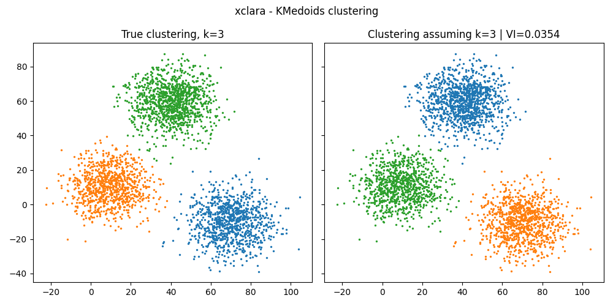
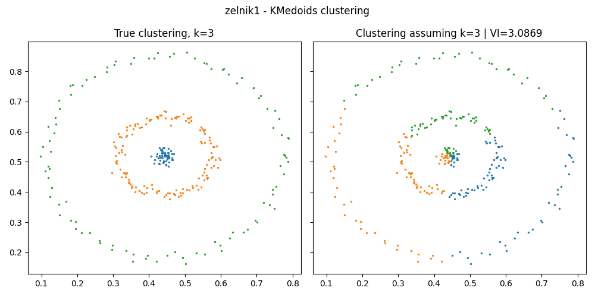

Variation of Information
----------------------------------

In this example, we compute the variation of information between the true clustering and the clustering predicted when assuming the correct number of clusters. We see that some clusterings methods are not adapted to some dataset and this is illustrated by a high variation of information (VI) between the predicted and the true clustering.

.. literalinclude:: ../../examples/variation_information/variation_information.py
   :lines: 7-54

.. literalinclude:: ../../examples/variation_information/output-variation_information_KMedoids.txt
   :language: text