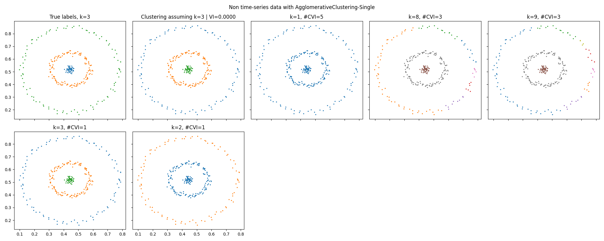

# Summary

PyCVI is a Python package specialized in internal Clustering Validity Indices (CVIs) compatible with both time-series and non time-series data.

Clustering is a task that aims at finding groups within a given dataset. CVIs are used to select the best clustering among a pre-computed set of clusterings. In other words, CVIs select the division of the dataset into groups that best ensures that similar datapoints belong to the same group and non-related datapoints are in different groups.

PyCVI implements 12 state-of-the-art *internal* CVIs to improve clustering pipelines as well as the Variation of Information [@Meil2003], a measure between clusterings that can be used as an *external* CVI. The *internal* qualifier here refers to the general case in practice where no *external* information is available about the dataset such as the true association of the datapoints with groups, as opposed to *classification* tasks.

# Statement of need

There exist many mature libraries in python for machine learning and in particular clustering [scikit-learn](https://scikit-learn.org/stable/index.html) [@scikitlearn], [TensorFlow](https://www.tensorflow.org/) [@tensorflow2015], [PyTorch](https://pytorch.org/) [@pytorch], [scikit-learn-extra](https://scikit-learn-extra.readthedocs.io/en/stable/) [@sklearn_extra], and even several specifically for time series data: [aeon](https://www.aeon-toolkit.org/en/latest/index.html) [@aeon], [sktime](https://www.sktime.net/en/stable/index.html) [@sktime], [tslearn](https://tslearn.readthedocs.io/en/stable/) [@tslearn].

However, although being fundamental to clustering tasks and being an active research topic, very few internal CVIs are implemented in standard python libraries (only 3 in [scikit-learn](https://scikit-learn.org/stable/index.html), more were available in R but few were maintained and kept in CRAN [@Charrad2014nbclust]). This is despite the well-known limitations of all existing CVIs [@Arbelaitz2013], [@Gagolewski2021], [@Gurrutxaga2011], [@Theodoridis2009Chap16] and the need to use the right one(s) according to the specific dataset at hand, similarly to matching the right clustering method with the given problem.

<!-- The elbow method is a well-known technique to find the correct number of clusters when using the KMeans algorithm. It consists in finding the elbow of the inertia curve with increasing number of clusters. Finding the elbow of a curve is a general method with application (mostly) outside clustering. @Satopaa2011 introduced the kneedle method, implemented in python in the [kneed](https://kneed.readthedocs.io/en/latest/) package. However, while being a fundamental method outside clustering applications, the flaws of the elbow method to the select clusterings have been widely discussed. Research on CVIs is therefore a fundamental topic in the clustering field, and in spite of this, very few internal CVIs are implemented in standard python libraries (only 3 in [scikit-learn](https://scikit-learn.org/stable/index.html) [@scikitlearn], more were available in R but few were maintained and kept in CRAN). This is despite the well-known limitations of all existing CVIs and the need to use the right one(s) according to the specific dataset at hand. -->

In addition, all CVIs rely on the definition of a distance between datapoints and most of them on the notion of cluster center.

For non-time-series data, the distance between datapoints is usually the euclidean distance and the cluster center is defined as the usual average. Libraries such as [scipy](https://docs.scipy.org/doc/scipy/index.html), [numpy](https://numpy.org/doc/stable/), [scikit-learn](https://scikit-learn.org/stable/index.html), etc. offer a large selection of distance measures that are compatible with their main functions.

For time-series data however, the common distance used is Dynamic Time Warping (DTW) [@Berndt1994UsingDTW] and the barycenter of a group of time series is then not defined as the usual mean, but as the DTW Barycentric Average (DBA) [@Petitjean2011global]. Unfortunately, DTW and DBA are not compatible with the libraries mentioned above.

PyCVI then tries to fill that gap by implementing 12 state-of-the-art internal CVIs: Hartigan [@Strauss1975], Calinski-Harabasz [@Calinski1974dendrite], GapStatistic [@Tibshirani2001Estimating], Silhouette [@rousseeuw1987silhouettes], ScoreFunction [@Saitta2007Bounded], Maulik-Bandyopadhyay [@Maulik2002Performance], SD [@Halkidi2000Quality], SDbw [@halkidi2001clustering], Dunn [@Dunn1974Well], Xie-Beni [@Xie1991validity], XB* [@Kim2005New] and Davies-Bouldin [@Davies1979Cluster]. Then, in PyCVI their definition is extended in order to make them compatible with DTW and DBA in addition to non time-series data. PyCVI is entirely compatible with [scikit-learn](https://scikit-learn.org/stable/index.html), [scikit-learn-extra](https://scikit-learn-extra.readthedocs.io/en/stable/) [@sklearn_extra], [aeon](https://www.aeon-toolkit.org/en/latest/index.html) and [sktime](https://www.sktime.net/en/stable/index.html), in order to be easily integrated into any clustering pipeline in python. To ensure a fast a reliable computation of DTW and DBA, PyCVI relies on the [aeon](https://www.aeon-toolkit.org/en/latest/index.html) library.

# Example

 \label{fig:kmeans}

 \label{fig:agglo}

We experimented on 3 different cases: non time-series data [@barton2015clustering], time-series data [@UCRArchive2018] with euclidean distance and time-series data with DTW and DBA as distance measure and center of clusters.

For each case, we used a different clustering method from a different library: KMeans [@lloyd1982least] and AgglomerativeClustering [@Ward1963] from [scikit-learn](https://scikit-learn.org/stable/index.html), TimeSeriesKMeans from [aeon](https://www.aeon-toolkit.org/en/latest/index.html) and KMedoids [@Kaufman1990Partitioning] from [scikit-learn-extra](https://scikit-learn-extra.readthedocs.io/en/stable/) in order to give examples of integration with other clustering libraries. Then, for each case, we ran all the CVIs implemented in PyCVI, selected the best clustering according to each CVI and plotted the selected clustering.

Finally, we computed the variation of information between each selected clustering and the true clustering (second plot of all figures). A large variation of information indicates a poor clustering quality. In fig \autoref{fig:kmeans} and \autoref{fig:agglo}, we can see the difference when assuming the correct number of clusters between the AgglomerativeClustering and the KMeans clustering method on the non time-series data. The poor quality of the clustering selected by the CVI can then either be due to the clustering method or the CVI, hence the necessity of robust evaluation pipeline for both clustering methods and CVIs.

The code of this example is available on the [GitHub repository](https://github.com/nglm/pycvi/tree/master/examples) of the package, as well as on its documentation.

# Acknowledgements

We thank the climate and energy transition strategy of the University of Bergen in Norway (UiB) for funding this work.

# References