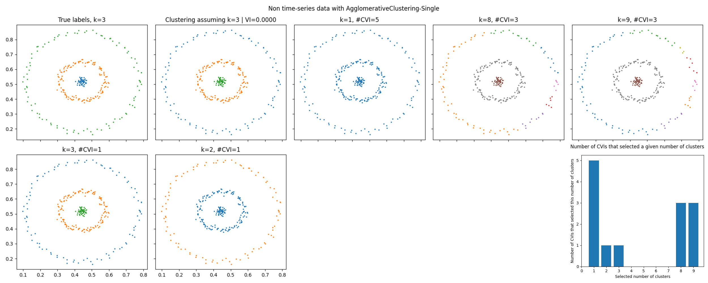

# Summary

PyCVI is a Python package specialized in internal Clustering Validity Indices (CVIs) compatible with both time-series and non time-series data.

Clustering is a task that aims at finding groups within a given dataset. CVIs are used to select the best clustering among a pre-computed set of clusterings. In other words, CVIs select the division of the dataset into groups that best ensures that similar datapoints belong to the same group and non-related datapoints are in different groups.

PyCVI implements 12 state-of-the-art *internal* CVIs to improve clustering pipelines as well as the Variation of Information (VI) [@Meil2003], a distance measure between clusterings. VI can have many purposes, among which being used as an *external* CVI and to evaluate internal CVIs or clustering methods when true labels are known. The *internal* qualifier here refers to the general case in practice where no *external* information is available about the dataset such as the true association of the datapoints with groups, as opposed to *classification* tasks.

# Statement of need

There exists many mature libraries in python for machine learning and in particular clustering [scikit-learn](https://scikit-learn.org/stable/index.html) [@scikitlearn], [TensorFlow](https://www.tensorflow.org/) [@tensorflow2015], [PyTorch](https://pytorch.org/) [@pytorch], [scikit-learn-extra](https://scikit-learn-extra.readthedocs.io/en/stable/) [@sklearn_extra], and even several specifically for time series data: [aeon](https://www.aeon-toolkit.org/en/latest/index.html) [@aeon], [sktime](https://www.sktime.net/en/stable/index.html) [@sktime], [tslearn](https://tslearn.readthedocs.io/en/stable/) [@tslearn].

However, although being fundamental to clustering tasks and being an active research topic, very few internal CVIs are implemented in standard python libraries (only 3 in [scikit-learn](https://scikit-learn.org/stable/index.html), more were available in R but few were maintained and kept in CRAN [@Charrad2014nbclust]). Thus for a given CVI, there is currently no corresponding maintained and public implementation. This is despite the well-known limitations of all existing CVIs [@Arbelaitz2013], [@Gagolewski2021], [@Gurrutxaga2011], [@Theodoridis2009Chap16] and the need to use the right one(s) according to the specific dataset at hand, similarly to matching the right clustering method with the given problem. A crucial step towards developing better CVIs would be an easy access to an implementation of existing CVIs in order to facilitate larger comparative studies.

In addition, all CVIs rely on the definition of a distance between datapoints and most of them on the notion of cluster center.

For static data, the distance between datapoints is usually the euclidean distance and the cluster center is defined as the usual average. Libraries such as [scipy](https://docs.scipy.org/doc/scipy/index.html), [numpy](https://numpy.org/doc/stable/), [scikit-learn](https://scikit-learn.org/stable/index.html), etc. offer a large selection of distance measures that are compatible with their main functions.

For time-series data however, the common distance used is Dynamic Time Warping (DTW) [@Berndt1994UsingDTW] and the barycenter of a group of time series is then not defined as the usual mean, but as the DTW Barycentric Average (DBA) [@Petitjean2011global]. Unfortunately, DTW and DBA are not compatible with the libraries mentioned above. This, among other reasons, made additional machine learning libraries specialized in time series data such as [aeon](https://www.aeon-toolkit.org/en/latest/index.html), [sktime](https://www.sktime.net/en/stable/index.html) and [tslearn](https://tslearn.readthedocs.io/en/stable/) necessary.

PyCVI fills that gap by implementing 12 state-of-the-art internal CVIs: Hartigan [@Strauss1975], Calinski-Harabasz [@Calinski1974dendrite], GapStatistic [@Tibshirani2001Estimating], Silhouette [@rousseeuw1987silhouettes], ScoreFunction [@Saitta2007Bounded], Maulik-Bandyopadhyay [@Maulik2002Performance], SD [@Halkidi2000Quality], SDbw [@halkidi2001clustering], Dunn [@Dunn1974Well], Xie-Beni [@Xie1991validity], XB* [@Kim2005New] and Davies-Bouldin [@Davies1979Cluster]. Then, in PyCVI their definition is extended in order to make them compatible with DTW and DBA in addition to static data. Finally, PyCVI is entirely compatible with [scikit-learn](https://scikit-learn.org/stable/index.html), [scikit-learn-extra](https://scikit-learn-extra.readthedocs.io/en/stable/), [aeon](https://www.aeon-toolkit.org/en/latest/index.html) and [sktime](https://www.sktime.net/en/stable/index.html), in order to be easily integrated into any clustering pipeline in python. To ensure a fast a reliable computation of DTW and DBA, PyCVI relies on the [aeon](https://www.aeon-toolkit.org/en/latest/index.html) library.

# Example

We experimented 3 cases: static data [@barton2015clustering], time-series data [@UCRArchive2018] with euclidean distance and then with DTW as distance measure and and DBA as center of clusters. In addition, we used different clustering methods from different libraries: KMeans [@lloyd1982least] and AgglomerativeClustering [@Ward1963] from [scikit-learn](https://scikit-learn.org/stable/index.html), TimeSeriesKMeans from [aeon](https://www.aeon-toolkit.org/en/latest/index.html) and KMedoids [@Kaufman1990Partitioning] from [scikit-learn-extra](https://scikit-learn-extra.readthedocs.io/en/stable/) to showcase PyCVI integration with other clustering libraries.

As a first example, we individually ran all CVIs implemented in PyCVI, selected the best clustering according to each CVI and plotted the selected clustering. In addition, we computed the variation of information (VI) between each selected clustering and the true clustering. High VI values there mean large distances between the true clustering and the computed clusterings, meaning poor computed clusterings. In \autoref{fig:kmeans} and \autoref{fig:agglo}, we can see the difference of quality when assuming the correct number of clusters between the AgglomerativeClustering and the KMeans clustering method on static data. This is independent of the CVI used, meaning that a poor clustering quality will be due to the clustering method.

In \autoref{fig:kmeans}, since the generated clusterings are poor due to the clustering method, the poor selection results gives us no information about the correct clustering, nor about the quality of the CVIs used. This motivates further research on clustering methods. However, in \autoref{fig:agglo}, the quality of the clustering is excellent, as indicated by a null VI. The corresponding selection results shown in the corresponding histogram tells us that the CVIs used here are not adapted to this dataset. This was expected since most CVIs rely on the cluster center to compute a good separation between clusters. The dataset here consisting of concentric circles, most CVIs fail to measure how well separated the clusters actually are. This illustrates the need of further research on CVIs, which is facilitated by PyCVI, notably in the case of concentric subgroups.

Similarly, with time-series data, the quality of the clustering assuming the correct number of clusters varies between \autoref{fig:DTW} and \autoref{fig:no_DTW} although the same clustering method is used on the same dataset. This illustrates the difference between using DTW as a distance measure compared to using the euclidean distance, and between using DBA to compute the average of a group of time series and using the usual average.

In a second example, we demonstrate cases of successful clustering and clustering selection, while showcasing an additional feature of PyCVI: `CVIAggregator`. `CVIAggregator` selects the best clustering by combining several CVIs and by using the majority vote among the clusterings individually selected by the combined CVI.

In \autoref{fig:all_cvis}, we used `CVIAggregator` with all CVIs implemented in PyCVI. We see that the data was correctly clustered by the clustering method and the best clustering correctly selected. This is in spite of clusters of non-convex shapes.

\autoref{fig:some_cvis} used `CVIAggregator` with only some of the implemented CVIs, as it could be done in practice when known characteristics of the dataset can help identify unadapted CVIs. Here as well, the data was correctly clustered and the best clustering correctly selected, in spite of clusters "touching" each other.

The code of these examples is available on the [GitHub repository](https://github.com/nglm/pycvi) of the package, and its [documentation](https://pycvi.readthedocs.io/en/latest/).

# Acknowledgements

We thank the climate and energy transition strategy of the University of Bergen in Norway (UiB) for funding this work.

# References