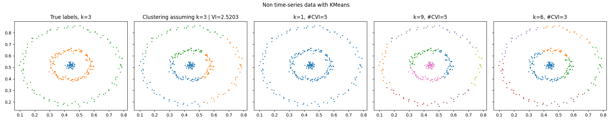
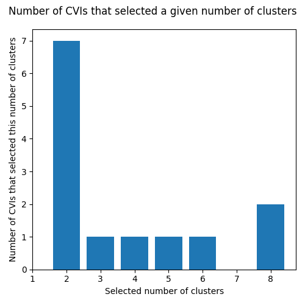

# Summary

PyCVI is a Python package specialized in internal Clustering Validity Indices (CVIs) compatible with both time-series and non time-series data.

Clustering is a task that aims at finding groups within a given dataset. CVIs are used to select the best clustering among a pre-computed set of clusterings. In other words, CVIs select the division of the dataset into groups that best ensures that similar datapoints belong to the same group and non-related datapoints are in different groups.

PyCVI implements 12 state-of-the-art *internal* CVIs to improve clustering pipelines as well as the Variation of Information [@Meil2003], a measure between clusterings that can be used as an *external* CVI. The *internal* qualifier here refers to the general case in practice where no *external* information is available about the dataset such as the true association of the datapoints with groups, as opposed to *classification* tasks.

# Statement of need

There exist many mature libraries in python for machine learning and in particular clustering [scikit-learn](https://scikit-learn.org/stable/index.html) [@scikitlearn], [TensorFlow](https://www.tensorflow.org/) [@tensorflow2015], [PyTorch](https://pytorch.org/) [@pytorch], [scikit-learn-extra](https://scikit-learn-extra.readthedocs.io/en/stable/) [@sklearn_extra], and even several specifically for time series data: [aeon](https://www.aeon-toolkit.org/en/latest/index.html) [@aeon], [sktime](https://www.sktime.net/en/stable/index.html) [@sktime], [tslearn](https://tslearn.readthedocs.io/en/stable/) [@tslearn].

However, although being fundamental to clustering tasks and being an active research topic, very few internal CVIs are implemented in standard python libraries (only 3 in [scikit-learn](https://scikit-learn.org/stable/index.html), more were available in R but few were maintained and kept in CRAN [@Charrad2014nbclust]). Thus for a given CVI, there is currently no corresponding maintained and public python implementation. This is despite the well-known limitations of all existing CVIs [@Arbelaitz2013], [@Gagolewski2021], [@Gurrutxaga2011], [@Theodoridis2009Chap16] and the need to use the right one(s) according to the specific dataset at hand, similarly to matching the right clustering method with the given problem. A crucial step towards developing better CVIs would be an easy access to an implementation of existing CVIs in order to facilitate larger comparative studies.

In addition, all CVIs rely on the definition of a distance between datapoints and most of them on the notion of cluster center.

For non-time-series data, the distance between datapoints is usually the euclidean distance and the cluster center is defined as the usual average. Libraries such as [scipy](https://docs.scipy.org/doc/scipy/index.html), [numpy](https://numpy.org/doc/stable/), [scikit-learn](https://scikit-learn.org/stable/index.html), etc. offer a large selection of distance measures that are compatible with their main functions.

For time-series data however, the common distance used is Dynamic Time Warping (DTW) [@Berndt1994UsingDTW] and the barycenter of a group of time series is then not defined as the usual mean, but as the DTW Barycentric Average (DBA) [@Petitjean2011global]. Unfortunately, DTW and DBA are not compatible with the libraries mentioned above, which among other reasons, made additional machine learning libraries specialized in time series data such as [aeon](https://www.aeon-toolkit.org/en/latest/index.html), [sktime](https://www.sktime.net/en/stable/index.html) and [tslearn](https://tslearn.readthedocs.io/en/stable/) necessary.

PyCVI then tries to fill that gap by implementing 12 state-of-the-art internal CVIs: Hartigan [@Strauss1975], Calinski-Harabasz [@Calinski1974dendrite], GapStatistic [@Tibshirani2001Estimating], Silhouette [@rousseeuw1987silhouettes], ScoreFunction [@Saitta2007Bounded], Maulik-Bandyopadhyay [@Maulik2002Performance], SD [@Halkidi2000Quality], SDbw [@halkidi2001clustering], Dunn [@Dunn1974Well], Xie-Beni [@Xie1991validity], XB* [@Kim2005New] and Davies-Bouldin [@Davies1979Cluster]. Then, in PyCVI their definition is extended in order to make them compatible with DTW and DBA in addition to non time-series data. Finally, PyCVI is made entirely compatible with [scikit-learn](https://scikit-learn.org/stable/index.html), [scikit-learn-extra](https://scikit-learn-extra.readthedocs.io/en/stable/), [aeon](https://www.aeon-toolkit.org/en/latest/index.html) and [sktime](https://www.sktime.net/en/stable/index.html), in order to be easily integrated into any clustering pipeline in python. To ensure a fast a reliable computation of DTW and DBA, PyCVI relies on the [aeon](https://www.aeon-toolkit.org/en/latest/index.html) library.

# Example

{width="50%"}

{width="50%"}

{width="50%"}

{width="50%"}

We first experimented on 3 different cases: non time-series data [@barton2015clustering], time-series data [@UCRArchive2018] with euclidean distance and time-series data with DTW and DBA as distance measure and center of clusters.

For each case, we used a different clustering method from a different library: KMeans [@lloyd1982least] and AgglomerativeClustering [@Ward1963] from [scikit-learn](https://scikit-learn.org/stable/index.html), TimeSeriesKMeans from [aeon](https://www.aeon-toolkit.org/en/latest/index.html) and KMedoids [@Kaufman1990Partitioning] from [scikit-learn-extra](https://scikit-learn-extra.readthedocs.io/en/stable/) in order to give examples of integration with other clustering libraries. Then, for each case, we ran all the CVIs implemented in PyCVI, selected the best clustering according to each CVI and plotted the selected clustering.

Finally, we computed the variation of information (VI) between each selected clustering and the true clustering (second plot of all figures). A large variation of information there indicates a poor clustering quality due to the clustering method. In \autoref{fig:kmeans} and \autoref{fig:agglo}, we can see the difference of quality when assuming the correct number of clusters between the AgglomerativeClustering and the KMeans clustering method on the non time-series data. Therefore, when the quality of the clustering selected by the CVI is poor it can then either be due to the clustering method or due to the CVI, hence the necessity of robust evaluation pipeline for both clustering methods and CVIs.

In \autoref{fig:kmeans}, since the generated clusterings are poor due to the clustering method, the poor results indicated by the histogram in \autoref{fig:kmeans-hist} gives us no information about the correct number of clusters, nor about the quality of the CVIs used. However, in \autoref{fig:agglo}, the quality of the clustering is excellent, as indicated by a null VI. The poor results shown in the corresponding histogram \autoref{fig:agglo-hist} tells us that the CVI used here are not adapted to this dataset. This was expected since most CVIs rely on the cluster center to compute a good separation between clusters. The dataset here consist of concentric circles, which means that most CVIs fail to measure how well separated the clusters actually are. This illustrates the need of further research on CVIs, which is facilitated by PyCVI, notably in the case of concentric subgroups.

Similarly, in the case of time-series data, we see a difference in the quality of the clustered data assuming the correct number of clusters in figures \autoref{fig:DTW} and \autoref{fig:no_DTW}, although the same clustering method, KMeans, is used. This is this time due to difference between using DTW as a distance measure compared to using the euclidean distance, and consequently, the difference between using DBA to compute the average of a group of time series and using the usual average.

However, both time series cases suggest that there are only two clusters, as indicated by figures \autoref{fig:DTW-hist} and \autoref{fig:no_DTW-hist}. And indeed, when looking at the true labels, we see that the purple and green clusters are very similar, one being slightly more noisy than the other. In addition, the red one and the blue one are also very similar, except for the time steps between 50 and 100 (one goes up while the other goes down). This illustrates the possibility of multiple relevant interpretations of clustered data, and ideally CVIs could be used to assess the relevance of the different interpretations. In figure \autoref{fig:DTW-hist}, we see for example that 2 clusters is the most relevant interpretation, which is an acceptable interpretation given our analysis of the clusters, but is still probably less relevant than interpreting the data has consisting of 4 clusters, knowing that this is the actual number of clusters in the dataset. Thus, ideally, figures \autoref{fig:no_DTW-hist} and \autoref{fig:DTW-hist} should have two high bars, one for 2 clusters and one for 4 clusters. However, most CVIs seem to fail to identify 4 clusters, yielding a very low bar for $k=4$ in both figures \autoref{fig:no_DTW-hist} and \autoref{fig:DTW-hist}. This suggests that future work on CVIs could significantly improve the quality of selected clusterings and could give us more insights on the relevant interpretation of the data in case of ambiguous clusters.

The code of this first example is available on the [GitHub repository](https://github.com/nglm/pycvi/tree/master/examples/select_k/) of the package, as well as on its [documentation](https://pycvi.readthedocs.io/en/latest/examples/select_k.html).

Then, in a second example, we demonstrate cases of successful clustering and clustering selection, while showcasing an additional feature of PyCVI: `CVIAggregator`. `CVIAggregator` is a class that makes it easy to select the best clustering by combining several CVIs and by using the majority vote among the clusterings individually selected by the combined CVI.

In figure \autoref{fig:all_cvis}, we used `CVIAggregator` with all the CVIs implemented in PyCVI. We see that the data was correctly clustered by the clustering method and the `CVIAggregator` correctly selected the best clustering with 9 votes out of the 14 CVIs used. This is in spite of clusters of non-convex shapes.

In figure \autoref{fig:some_cvis}, we used `CVIAggregator` with only some of the CVIs implemented in PyCVI, as it could be done in practice when the user has some information about the dataset and therefore can exclude CVIs that are not adapted to the known characteristics of the dataset. Again, we see that the data was correctly clustered and the best clustering correctly selected with 4 votes out of the 5 CVIs used. This is in spite of clusters "touching" each other.

The code of this second example is available on the [GitHub repository](https://github.com/nglm/pycvi/tree/master/examples/cvi_aggregator/) of the package, as well as on its [documentation](https://pycvi.readthedocs.io/en/latest/examples/cvi_aggregator.html).

# Acknowledgements

We thank the climate and energy transition strategy of the University of Bergen in Norway (UiB) for funding this work.

# References